# Bài test công ty finsify
## Yêu cầu: Xây dựng 1 ứng dụng đơn giản (CRUD app) có các chức năng thêm, sửa, xóa, hiển thị danh sách của  sinh viên
* Trong ứng dụng của mình tác giả chỉ dùng express js, database MongoDb, template hiển thị là ejs (vì mình chưa thạo angular nên mình chỉ sử dụng server-side rendering nếu có thời gian nhất định sẽ sử dụng MongoDb + Express js + Angular + Node js)
* Đầu tiên định nghĩa các trường dữ liệu của 1 sinh viên như sau:
* Tạo 1 thư mục models trong ứng dụng chứa file Employees.js file này định nghĩa 1 shema
 ```javascript 
        var mongoose = require('mongoose');
        var EmployeeShema = new mongoose.Schema({
            name: String,
            address: String,
            position: String,
            age: Number,
            id_card: String,
            update_at:{
                type: Date, default: Date.now
            }
        });
module.exports = mongoose.model('Employee',EmployeeShema)
```
* code kết nối tới thư viện mongoDb như sau:
```javascript
    //connect to mongodb server
    mongoose.connect('mongodb://localhost:27017/employees')
    .then(() => console.log('connection succesful'))
    .catch((err) => console.log(err))
```
* với tên database là employees
* Tạo 1 thư mục controller thư mục này chứa EmployeesController.js tất cả dữ liệu sẽ được lấy ở đây
```javascript
    var mongoose = require('mongoose');
    var Employee = require('../models/Employee');
    var employeeController = {};
```
* Khai báo trên dùng để requrie các thư viện mongoose để có thể sử dụng được các phương thức trong mongoose và định nghĩa 1 đối tượng sinh viên ban đầu.
## Khởi tạo 1 sinh viên
* Khi nhập đường dẫn : http://localhost:4000/employees thì sẽ render ra trang create.ejs trong thưc mục views

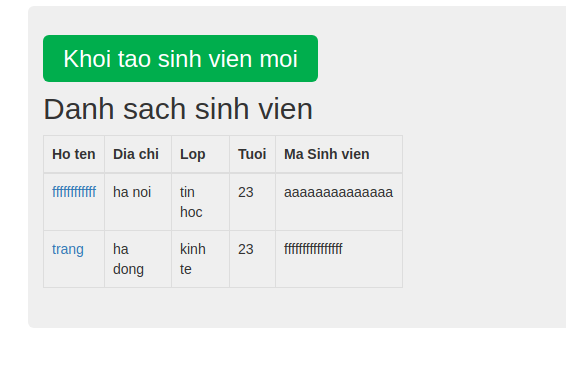
* Sẽ hiển thị 1 table chứa thông tin sinh viên, và có 1 button khởi tạo sinh viên. 
* đoạn code dưới đây thể hiện list ra 1 danh sách sinh viên
```javascript
    employeeController.list = function(req, res) {
    Employee.find({}).exec(function(err,employees) { // phuowng thuc exec la thuc thi 1 cau lenh
        if(err) {
            console.log("Error",err)
        } else {
            res.render("../views/employees/index", { employees: employees})         
        }
    })
}
```
* Nó sẽ render ra trang index trong thuc mục views/employees
* Khi nhấn vào button khởi tạo sinh viên thì lúc này đường dẫn se là http://localhost:4000/employees/create và hiển thị như sau:
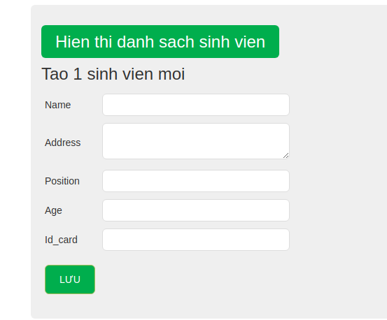
* bao gồm 1 button hiên thị danh sách sinh viên, 1 form, và 1 button sẽ tiến hành lưu thông tin sinh viên. Khi điền các thông tin vào form và nhấn button "Luu" thì sẽ tiến hành đấy dữ liệu của sinh viên vào trong Database code thể hiên như sau:
```javascript
    employeeController.save = function(req, res ){
    var employee = new Employee(req.body);
    employee.save(function(err) {
        if(err) {
            console.log(err)
            res.render("../views/employees/create");
        } else {
            res.redirect("/employees/show/"+employee._id)
            
        }
    })
}
```
* Trong database sẽ có dạng như sau:
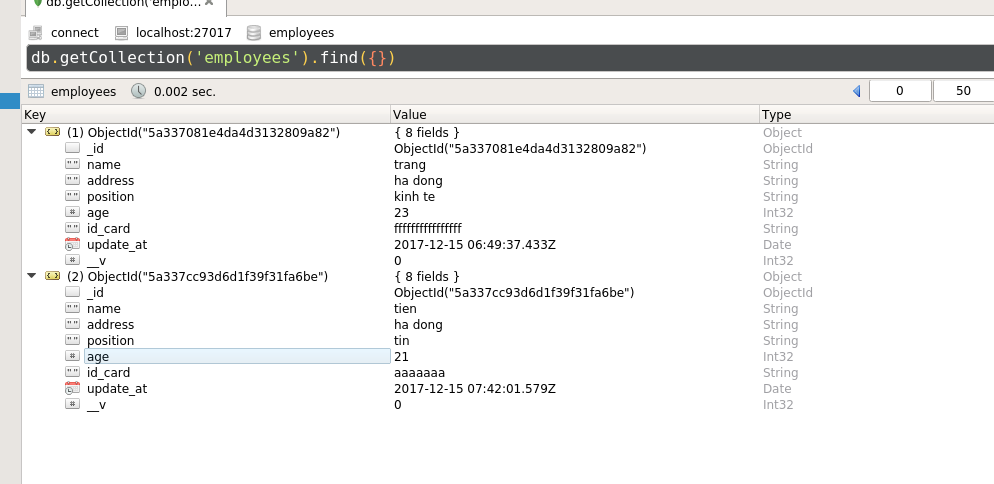
* Nếu đã insert vào database thành công thì redirect sang trang show.ejs trong thư mục views/employees và hiển thị như sau:
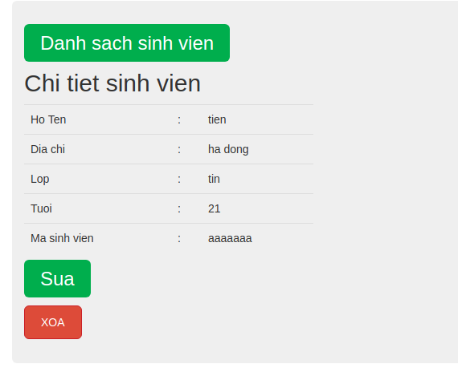
* Hiển thi ra trang chứa các thông tin chi tiết của sinh viên, 1 button hiển thị danh sách sinh viên, 1 button sửa, 1 button xóa.
* Khi nhấn vào button danh sách sinh viên thì sẽ hiển thị list các sinh vien có trong database
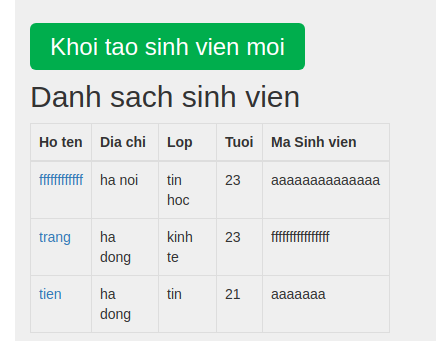 
* trong đó ở ô họ tên sinh viên là 1 đường dẫn mà khi click vào sẽ hiển thị ra trang với ulr như sau: http://localhost:4000/employees/show/5a337cc93d6d1f39f31fa6be
sẽ render ra trang:
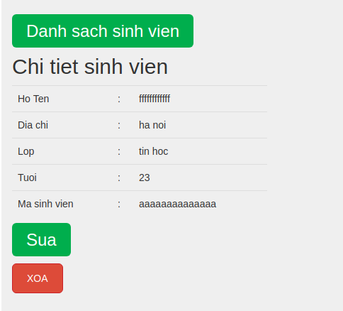
* Khi click vào button sửa thì sẽ hiện ra bảng sau:
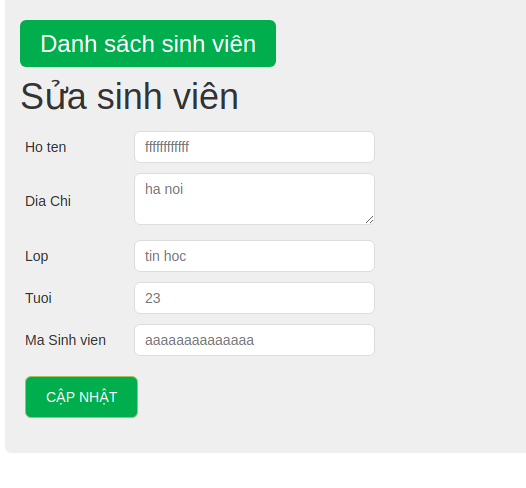
* code:
```javascript
    employeeController.edit = function(req,res) {
    Employee.findOne({_id: req.params.id}).exec(function(err,employee){
        if(err) {
            console.log("Error:",err)
        } else {
           res.render("../views/employees/edit",{employee: employee})
           
        }
    })
```
* Ta tiến hành điền lại thông tin cần sửa sau đó nhấn "Cập Nhật" thì thông tin sẽ được lưu lại trong database với code như sau:
```javascript
    employeeController.update = function(req,res) {
    Employee.findByIdAndUpdate(req.params.id, {
        $set: {
            name: req.body.name, 
            address: req.body.address,
            position: req.body.position, 
            age: req.body.age, 
            id_card: req.body.id}}
    , function(err,employee){
        if(err) {
            console.log(err)
            res.render("../views/employees/edit",{employee: req.body})
        } 
        res.redirect("/employees/show/"+employee._id)
        
    }
    )
}
```
* Sẽ hiển thị lại thông tin của sinh viên sau khi sửa

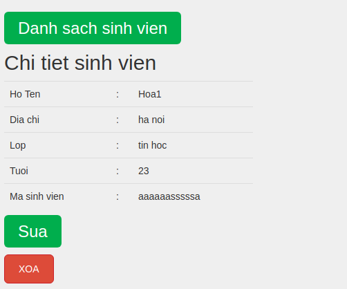

* Tiến hành xóa sinh viên như sau: khi click vào button "Xóa" thì sẽ xóa sinh viên trong database và đồng thời đường dẫn lúc này là: http://localhost:4000/employees đường dẫn này được định nghĩa trong file show.ejs có dạng như sau:
```javascript
    <form action="/employees/delete/<%= employee._id%>" method="post">
        <button type="submit">Xoa</button>
      </form>
```
* Method có dạng post nên sẽ không hiển thị trên url đồng thời xử lý requet này bên file EmployeeController.js như sau:
```javascript
    employeeController.delete = function(req,res) {
    Employee.remove({_id: req.params.id},function(err){
        if(err) {
            console.log(err)
        }
        else {
            console.log("Employee Deleted!");
            res.redirect("/employees")
        }
    })
}
```
với phương thưc remove là phương thức được sử dụng từ thư viện mongoose với phương thức này thì sẽ tìm sinh viên theo id và sẽ xóa trong database
* Kết quả hiển thị như sau:
* trước khi xóa:
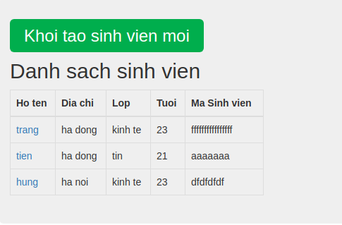
* Khi click vào tên của 1 sinh viên

* Sau khi click "Xoa"
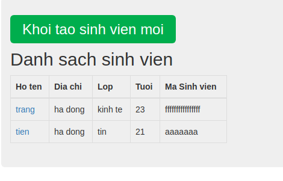
## Còn lại phần route của sinh viên được định nghĩa trong thư mục router/employee.js
* Để chạy được chương trình thì cần phải cài đặt mongoDb chi tiết tham khảo tại :https://docs.mongodb.com/v2.8/administration/install-on-linux/
* Cài đặt Robo3T để quản lý database tham khảo đường dẫn sau: https://robomongo.org/
* Cài các package cần thiết trong package.json bằng lệnh npm i
* Sau đó chạy node app.js 
* Mở trình duyệt chạy: http://localhost:4000/employees sẽ hiển thị ra trang chủ có giao diện đơn giản như sau:
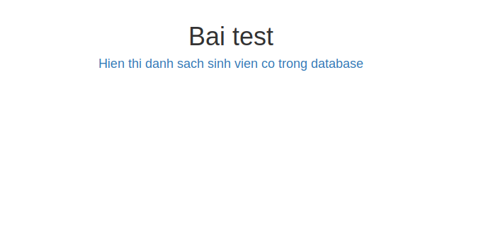
* Tiến hành click vào text "hien thi danh sach sinh vien co trong database" sau đó tiến hành làm theo như hướng dẫn ở trên


